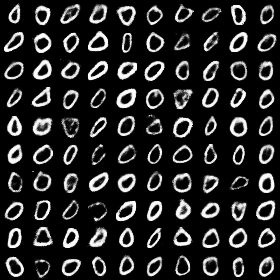
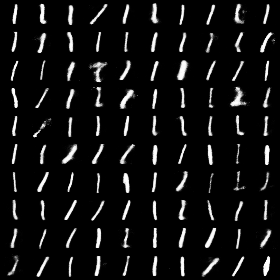
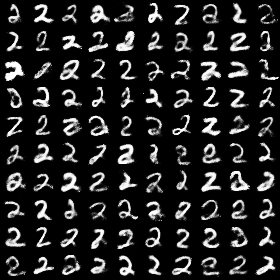
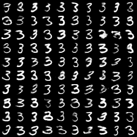
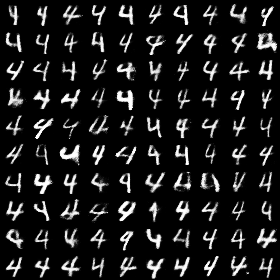
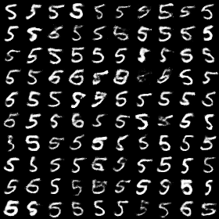
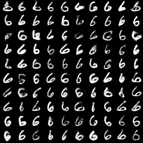
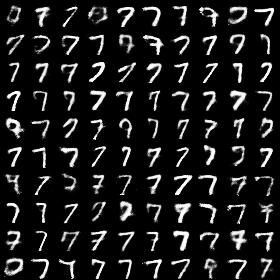
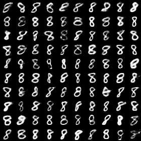
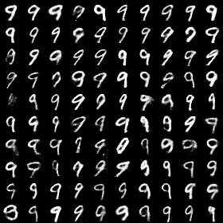

# CVAE implementation in ZhuSuan
This repository contains an implementation of a Class-conditioned VAE (CVAE) using [ZhuSuan](https://github.com/thu-ml/zhusuan) on the MNIST dataset.
This is a coding assignment from the Machine Learning course at Tsinghua University, Fall Semester 2020.  

# Installation
Clone the repository and install the requirements in your machine by running:
```
(venv) pip install -r requirements.txt
```
Note: It is recommended to use a virtual environment to install all the dependencies.

# Quick start
You can train a model by running the following command and changing the arguments accordingly. `Arguments in square brackets are optional (all arguments)`.
```
(venv) python3 cvae.py [--gpu <DEVICE_ID>]

                       [--zdim <Z_DIM>]
                       [--lr <LEARNING_RATE>] 
                       [--epochs <NUMBER_OF_EPOCHS>]
                       [--batch_size <BATCH_SIZE>]

                       [--save_model_freq <...>]
                       [--save_img_freq <...>]

                       [--data_dir <path to the dataset>]
                       [--results_path <path to save the results>]
                       [--checkpoints_path <path to save the model weights>]
```

# Results
A model trained after 100 epochs with learning rate of 0.001 can generate images like these:

| 0 | 1 | 2 | 3 | 4 | 
| :---:        | :---:    | :---:         | :---:        | :------: | 
|  |     |         |         |     | 
| 5 | 6 | 7 | 8 | 9 | 
|         |    |         |       |   | 

# License
```
MIT License

Copyright (c) 2020 Héctor Martel

Permission is hereby granted, free of charge, to any person obtaining a copy
of this software and associated documentation files (the "Software"), to deal
in the Software without restriction, including without limitation the rights
to use, copy, modify, merge, publish, distribute, sublicense, and/or sell
copies of the Software, and to permit persons to whom the Software is
furnished to do so, subject to the following conditions:

The above copyright notice and this permission notice shall be included in all
copies or substantial portions of the Software.

THE SOFTWARE IS PROVIDED "AS IS", WITHOUT WARRANTY OF ANY KIND, EXPRESS OR
IMPLIED, INCLUDING BUT NOT LIMITED TO THE WARRANTIES OF MERCHANTABILITY,
FITNESS FOR A PARTICULAR PURPOSE AND NONINFRINGEMENT. IN NO EVENT SHALL THE
AUTHORS OR COPYRIGHT HOLDERS BE LIABLE FOR ANY CLAIM, DAMAGES OR OTHER
LIABILITY, WHETHER IN AN ACTION OF CONTRACT, TORT OR OTHERWISE, ARISING FROM,
OUT OF OR IN CONNECTION WITH THE SOFTWARE OR THE USE OR OTHER DEALINGS IN THE
SOFTWARE.
```